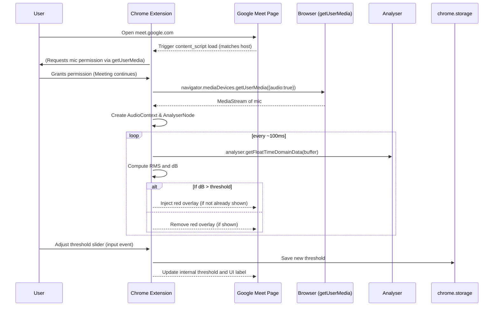

# Executive Summary

We propose a **Manifest V3 Chrome extension** that runs only on Google Meet pages. When installed, it requests microphone access (the browser will prompt “meet.google.com wants to use your microphone”【24†L364-L372】). In the Meet tab, the extension injects a small floating UI allowing the user to set a volume threshold (via a range slider). In the background, it captures audio from the user’s headset mic, measures loudness in real time using the Web Audio API, and **overlays a red screen and warning text** on the Meet page whenever the user’s voice level stays above the set threshold for a short duration. All audio processing happens locally: we compute the root-mean-square (RMS) of the audio signal to estimate decibels【17†L207-L214】【24†L364-L372】. No actual audio is recorded or transmitted anywhere. The threshold is user-configurable (stored via `chrome.storage`), and a debounce ensures flickers don’t trigger false alarms. 

This spec covers all aspects: **goals/non-goals**, detailed requirements (permissions, UI flows, UX wording, calibration ideas, slider behavior, timing rules, device selection), technical design (file structure, manifest.json, content scripts, background/service worker if any, injected HTML/CSS/JS, using `getUserMedia`, setting up `AudioContext`/`AnalyserNode`, RMS-to-dB conversion and calibration), performance and security considerations, handling Google Meet’s own mic usage, fallbacks when no mic is available, plus testing plans, accessibility/localization, metrics, and deployment. We also include release considerations (Chrome Web Store publishing steps with sample listing and privacy policy text【28†L329-L334】, enterprise deployment options), and a **step-by-step code-generation checklist** with exact files and code. Relevant official sources (Chrome Extension docs, Web Audio API docs, etc.) are cited throughout.

```mermaid
flowchart LR
    A[User’s Google Meet tab] --> B(Extension Content Script)
    B --> C{User allowed mic?}
    C -->|Yes| D[Capture audio via getUserMedia]
    D --> E[Web Audio AudioContext & AnalyserNode]
    E --> F[Compute RMS amplitude / dB]
    F --> G{Above threshold?}
    G -->|Yes (for >X ms)| H[Show red overlay & warning text]
    G -->|No| I[Ensure overlay hidden]
    B -.-> J[UI Slider & Controls] 
    B -.-> K{Uses chrome.storage (threshold)}
    J -->|Slider changes| K
    K --> B
    H --> B
```  

*Figure: High-level flow. The content script (injected into meet.google.com) requests mic, processes audio, and updates the UI overlay. The slider UI allows setting the threshold, saved in chrome.storage.*

# Goals and Non-Goals

- **Goal:** Create an **automated loudness alert tool** for Google Meet calls. Each user’s computer monitors *its own* microphone input and warns the user if they speak too loudly (beyond a user-settable threshold). The warning is a **full-tab red overlay with text** (notifying “You are speaking too loudly”). Users can adjust the threshold via a slider. The solution must work **per user/PC**, and only while on a Meet call. 

- **Non-Goal:** We are *not* attempting to measure or moderate *other participants’* volumes, or centralize data across multiple users. We do not control Meet’s built-in audio or attempt to automatically mute users; we only give the *local user* feedback. We also are *not* building a Google Workspace Meet Add-on (which is a different integration model), nor do we require any server-side components except optional telemetry. 

# Functional Requirements

### Permissions and Hosts

- **Host Permissions:** The extension needs access to Google Meet pages. In Manifest V3, we declare in `manifest.json`:
  ```json
  "host_permissions": [
    "https://meet.google.com/*"
  ]
  ```
  This ensures content scripts can run on any Google Meet URL. (Host permissions let the extension “inject” scripts into those pages【10†L278-L287】【12†L227-L236】.)

- **API Permissions:** 
  - `chrome.storage` (to remember user threshold settings) – declared as `"storage"` in `"permissions"`.  
  - No special audio or camera permissions are in `manifest.json` for the mic, since we will call `navigator.mediaDevices.getUserMedia({audio: true})` from a content script. The browser will automatically prompt the user for mic access (Meet is a secure context, so `getUserMedia` works)【24†L364-L372】.  
  - Optional: if implementing telemetry or error-reporting, an `optional_permissions` entry for `https://your.telemetry.endpoint/*` could be used, but we treat this as user opt-in only.  
  - We include `"activeTab"` or `"scripting"` only if needed for programmatic injection; static `content_scripts` should suffice, but `"activeTab"` can be added to allow the extension action if we want an icon click.

- **Manifest Sample:** An example manifest snippet:
  ```json
  {
    "manifest_version": 3,
    "name": "Meet Mic Volume Alert",
    "description": "Warns you if your microphone volume on Google Meet exceeds a set threshold.",
    "version": "1.0",
    "permissions": ["storage"],
    "host_permissions": ["https://meet.google.com/*"],
    "content_scripts": [
      {
        "matches": ["https://meet.google.com/*"],
        "js": ["content_script.js"],
        "css": ["overlay.css"],
        "run_at": "document_end"
      }
    ],
    "action": {
      "default_icon": {
        "16": "icon16.png", "48": "icon48.png", "128": "icon128.png"
      },
      "default_title": "Meet Volume Alert"
    },
    "icons": { "16": "icon16.png", "48": "icon48.png", "128": "icon128.png" }
  }
  ```
  Key fields explained in Table 1:

  | Field             | Type            | Description |
  |-------------------|-----------------|-------------|
  | `manifest_version`| number (3)      | Use Manifest V3. |
  | `host_permissions`| array of URLs   | `["https://meet.google.com/*"]` to inject into Meet pages【10†L278-L287】. |
  | `content_scripts` | list of objects | Includes one script/CSS entry for Meet pages. `run_at: "document_end"` ensures Meet’s UI is loaded. |
  | `permissions`     | list            | `"storage"` for settings; others as needed. |
  | `action`          | object          | Toolbar icon (optional, for user help or toggling). |
  | `icons`           | object          | Extension icons (16/48/128px) for store & toolbar. |

### UI Flows and UX

- **Activation:** The extension is **active only on `meet.google.com`** pages. When a user navigates to Meet, the content script loads automatically (no need to click the icon). On first run, it should prompt for mic permission (Chrome will show the standard “meet.google.com wants to use your microphone” prompt【24†L364-L372】). The user must allow it for the tool to work.

- **UI Elements:** 
  - A *floating control panel* (injected into the Meet DOM by the content script) with: 
    - A **slider** to set the volume threshold.
    - A label showing the current numeric value (in decibels or percent).
    - Possibly a “mic status” indicator (e.g. 🚫 if mic is unavailable).
  - When speaking above the threshold, the **full tab overlay** appears: a semi-transparent red layer covering the Meet window with a centered **warning message**, e.g. “🔊 You are speaking too loudly.” The overlay should allow clicks/pass-through so the user can still interact with the meeting (using `pointer-events:none`). 
  - When speaking returns below threshold, the red overlay disappears after a short delay.
  - Optionally, a **toolbar icon** can be clicked to show brief instructions or open an options page. We can use the `action` popup for help text or linking to an options page (not strictly required, but good practice).

- **Threshold Slider Behavior:** 
  - Range: We can map 0–100% to a corresponding decibel range. For UX, labeling the slider in “dB” may confuse non-technical users, but it is a standard measure of loudness. We can label it as e.g. “Threshold: –60 dB to 0 dB (full-scale)”, with a numeric readout. For example, normal speech may register ~ –30 to –20 dB; yelling might be ~ –10 to 0 dB. These values vary by mic and software gain. 
  - As the user moves the slider, the numeric value updates. The slider should use `<input type="range">` for accessibility, with appropriate `aria-label`. (ARIA docs note: a slider has a `role="slider"`, with `aria-valuemin`, `aria-valuemax`, and `aria-valuenow`【22†L248-L257】. Using `<input type="range">` automatically applies these roles.)
  - The slider’s value is stored in `chrome.storage.sync` (or `local`) so it persists. On each Meet page load, the script reads the saved threshold (or uses a default if none set, e.g. –20 dB).

- **Calibration Flow:** (Optional feature)
  - To help non-expert users, we might include a “calibrate” button. When clicked, the user is prompted to stay silent briefly, then speak in a normal voice. The extension measures the average RMS of silence and speaking to suggest a threshold (e.g. “Your normal speaking level is around –25 dB; we set the threshold at –15 dB above that”). This could auto-adjust the slider. This is **optional** and can be mentioned as future work. For now, the user manually adjusts the slider until the overlay doesn’t flicker on normal talk.

- **Debounce/Duration Rules:** To avoid flicker on brief spikes (e.g. coughing), require the loudness to **exceed the threshold continuously for a short duration** before showing the overlay. For example: if volume > threshold for >300 ms, show alert; once triggered, keep it on for at least 1 second or until volume drops below threshold for >500 ms. This can be implemented by tracking timestamps. The idea is to provide a smooth user experience.

- **Device Selection:** By default, `getUserMedia({audio: true})` uses the user’s default microphone. We should allow selecting a different mic if the user has multiple (e.g. built-in laptop vs. USB headset). This requires using `navigator.mediaDevices.enumerateDevices()` to list input devices, and a dropdown UI to pick one. Upon change, we restart the stream from the new device. (This adds complexity; it can be marked as “advanced option”.)

- **UI Copy (Text Strings):** Keep it concise and instructive.
  - Slider label: **“Volume Threshold”** with dynamic display (e.g. “Threshold: –20 dB”).
  - Overlay warning: something like **“🔊 Loud! Please lower your speaking volume.”** or “You are speaking too loudly”. Use a polite tone.
  - Error messages: “Microphone access denied” or “No microphone detected” if `getUserMedia` fails, and in this case the extension can show a small error banner.

- **In-Context Explanation:** It’s helpful to add a note in the UI that “This tool monitors only *your own* microphone volume.” Users may wonder if it’s analyzing others; make it clear it only measures their audio. This could be in a help tooltip or the extension popup.

### Calibration and Normalization

Because raw mic input levels vary by hardware and settings, it’s important to *normalize* or calibrate:

- **Ambient Noise Floor:** Optionally measure a few seconds of silence at startup to estimate background noise; subtract or ignore that so the threshold isn’t too low.  
- **Sample Rate:** Use the default sample rate (often 48 kHz) from the audio stream. 
- **Gain Variations:** Note that if the system amplifies the mic differently, the same voice might read different dB. We can at least ensure that the slider’s “0 dB” corresponds to the maximum measured level (full-scale). If using float data (-1..1), 0 dBFS means full volume. The formula `20*log10(rms)` will yield negative dB for any RMS < 1.

We will include a short calibration instruction in the README (e.g. “Speak at normal volume and adjust the slider so the red alert never appears during normal speech”). But auto-calibration is outside MVP.

# Technical Design

## File Structure

The extension will have a flat structure, for example:

```
meet-volume-alert/
├── manifest.json
├── content_script.js
├── overlay.css
├── icons/
│   ├── icon16.png
│   ├── icon48.png
│   └── icon128.png
├── popup.html        (optional)
├── popup.js          (optional)
└── _locales/
    └── en/messages.json   (for i18n strings, optional)
```

_Table 2: File list_

| File               | Purpose                                        |
|--------------------|------------------------------------------------|
| `manifest.json`    | Declares extension metadata and permissions【12†L227-L236】【10†L278-L287】. |
| `content_script.js`| Main logic injected into Meet: audio processing, overlay, UI. |
| `overlay.css`      | Styles for the injected UI (slider panel, red overlay). |
| `icon16.png, icon48.png, icon128.png` | Extension icons. 16px used in toolbar, 48 for store list, 128 for Chrome Web Store. |
| `popup.html/js` (optional) | If using extension toolbar popup for help/settings. Not required if UI is injected. |
| `_locales/en/messages.json` (optional) | For localization of UI strings (use `chrome.i18n`). |
| Other assets (e.g. screenshots) for store listing (see Deployment). |

## `manifest.json` (detailed)

Key fields:

- `"manifest_version": 3` – required.
- `"name"`, `"description"`, `"version"` – as desired.
- `"permissions": ["storage"]` – for using `chrome.storage.sync` to save threshold.
- `"host_permissions": ["https://meet.google.com/*"]` – to inject content on Meet pages.
- `"content_scripts"`: We'll specify our JS and CSS. Example entry:
  ```json
  "content_scripts": [
    {
      "matches": ["https://meet.google.com/*"],
      "js": ["content_script.js"],
      "css": ["overlay.css"],
      "run_at": "document_end"
    }
  ]
  ```
  This tells Chrome to load our script/CSS after the page loads (or idle), on any Meet URL. (Changing `matches` triggers install warnings【10†L278-L287】.)
- `"action"`: Defines the extension icon in toolbar. We can set a default title (tooltip). An optional popup can be defined here if we want a help page. For now:
  ```json
  "action": {
    "default_icon": {
      "16": "icons/icon16.png",
      "48": "icons/icon48.png",
      "128": "icons/icon128.png"
    },
    "default_title": "Meet Volume Alert"
  }
  ```
- `"icons"`: Listing the same icon paths for store requirements.

_Citation:_ The Manifest docs show using content_scripts and host_permissions【12†L227-L236】【10†L278-L287】. We will follow these guidelines exactly.

## Content Script and Background

We may not need a background/service worker at all, because all work is done in the page’s context. Content scripts in MV3 cannot use `window` APIs outside; but they have access to the DOM of meet.google.com and can use standard JS. 

**Why no background?**  The extension’s logic is entirely page-specific and real-time. We don’t need to communicate with a remote server or handle events outside the Meet tab. All storage (`chrome.storage`) and metrics can be handled in the content script or a small background for storage sync if needed.

However, if we want a separate “options page” or handle messages to a future server, a background could be added. For now, we assume **no service worker** (or an empty one) – everything is in content_script.js.

Content scripts in MV3 run in an isolated world, but can still use the full Web Audio API and create HTML. We should ensure our CSS does not conflict with Meet (e.g. use unique IDs). If needed, we could attach a Shadow DOM for isolation, but we can also ensure high `z-index` and unique IDs.

We will not use `chrome.scripting` (programmatic injection) because static content_scripts suffice.

### Content Script (`content_script.js`)

Responsibilities:

1. **Mic Access**: On load, call `navigator.mediaDevices.getUserMedia({audio: true})`. Wrap in try/catch:
   ```js
   try {
     const stream = await navigator.mediaDevices.getUserMedia({audio: true});
   } catch (err) {
     // Show error UI: "Microphone access needed"
   }
   ```
   The browser prompts user for permission; must be granted. If denied, we should detect the error (`NotAllowedError`) and display a persistent warning.

2. **Audio Setup**: Once we have the `MediaStream`, create an `AudioContext` (only one per page is fine). Example:
   ```js
   const audioContext = new AudioContext();
   const source = audioContext.createMediaStreamSource(stream);
   const analyser = audioContext.createAnalyser();
   analyser.fftSize = 2048;  // higher gives finer resolution
   source.connect(analyser);
   ```
   AnalyserNode will allow us to fetch waveform or frequency data. We will use time-domain for RMS.

3. **Volume Measurement**: Periodically (e.g., every 100ms), run a function:
   ```js
   const data = new Float32Array(analyser.fftSize);
   analyser.getFloatTimeDomainData(data);
   let sumSquares = 0;
   for (let i = 0; i < data.length; i++) {
     sumSquares += data[i] * data[i];
   }
   const rms = Math.sqrt(sumSquares / data.length);
   const dB = 20 * Math.log10(rms);
   ```
   This yields a negative dBFS value (0 dB = max possible). (Use `getFloatTimeDomainData` which returns normalized floats【17†L207-L214】.) A typical quiet voice might be around –30 to –20 dB. We can also just use `rms` directly (0–1) and scale our threshold slider accordingly.

4. **Threshold Check**: If `dB > thresholdDb` (threshold is also a negative number, say –15 dB), start a timer. If it stays above for >300ms, activate overlay. If it drops below threshold, schedule overlay hide after a short delay.

5. **UI Injection**: On script initialization, create DOM elements:
   ```html
   <div id="vol-control-panel">
     <label for="vol-threshold">Volume Threshold:</label>
     <input type="range" id="vol-threshold" min="-60" max="0" value="-20" step="1">
     <span id="vol-threshold-value">-20 dB</span>
   </div>
   <div id="vol-overlay" style="display:none;">
     <p>You are speaking too loudly</p>
   </div>
   ```
   - Style via `overlay.css` (see below). 
   - The `<input type="range">` automatically has ARIA `role="slider"`【22†L229-L237】. We should include `min`, `max`, `step`. We should update `aria-valuenow` via code or rely on the range's default. Also add `aria-label="Volume threshold"`.
   - The overlay `<div>` is a full-viewport fixed-position red semi-transparent layer, hidden by default.

6. **Slider Behavior**: Add an `input` event listener on `#vol-threshold`. When changed, update the `<span>` text, save the new threshold (in dB or percent) to `chrome.storage.sync`, and update our in-memory threshold variable. We should `debounce` rapid slider moves only to storage writes.

7. **Storage**: On load, do `chrome.storage.sync.get('threshold', callback)` to retrieve the saved threshold (or default –20). When user sets a new threshold, do `chrome.storage.sync.set({threshold: newValue})`. Content script can use the `chrome.storage` API directly since MV3.

8. **Handling Meet's Mic**: Note that Meet itself is using the mic. However, calling `getUserMedia` again for audio only should still work (Chrome allows multiple tracks). We do not need to interact with Meet’s stream at all. Our script just listens in. But we must ensure we don’t mute or interfere; we will only *listen* to the stream, not mute or replace it.

9. **Fallbacks**: If `getUserMedia` fails:
   - If no microphone: display a message like “No microphone found” in the control panel, disable functionality.
   - If permission denied: display “Microphone permission required” and maybe a link or button to re-request (some code can attempt `getUserMedia` again on user action).

10. **Debounce Logic**: Example pseudocode for overlay toggle:
    ```js
    let loudStart = null;
    let overlayVisible = false;
    setInterval(() => {
      if (dB > threshold) {
        if (!loudStart) loudStart = Date.now();
        if (!overlayVisible && (Date.now() - loudStart > 300)) {
          showOverlay();
          overlayVisible = true;
        }
      } else {
        loudStart = null;
        if (overlayVisible) {
          // keep visible for at least 1 second
          if (!overlayOffTimer) {
            overlayOffTimer = setTimeout(() => {
              hideOverlay();
              overlayVisible = false;
              overlayOffTimer = null;
            }, 1000);
          }
        }
      }
    }, 100);  // run every 100ms
    ```

### Injected Overlay and Styles (`overlay.css`)

We define CSS for:

- **Control Panel** (`#vol-control-panel`): position fixed (e.g. top-right corner), z-index high (e.g. 999999), small background (semi-transparent dark), padding. Example:
  ```css
  #vol-control-panel {
    position: fixed;
    top: 10px; right: 10px;
    background: rgba(0, 0, 0, 0.5);
    color: white; padding: 8px; border-radius: 4px;
    z-index: 999999; font-family: sans-serif; font-size: 14px;
  }
  #vol-control-panel input[type="range"] {
    width: 150px;
  }
  #vol-control-panel span { margin-left: 5px; }
  ```

- **Overlay** (`#vol-overlay`): covers entire viewport of tab. Example:
  ```css
  #vol-overlay {
    position: fixed;
    top: 0; left: 0; width: 100%; height: 100%;
    background-color: rgba(255, 0, 0, 0.3);
    display: none;  /* toggled by script */
    z-index: 999998;
    pointer-events: none;  /* allow clicks through */
  }
  #vol-overlay p {
    position: absolute;
    top: 50%; left: 50%;
    transform: translate(-50%, -50%);
    color: white; font-size: 2em; font-weight: bold;
    text-align: center;
    background: rgba(0,0,0,0.5); padding: 20px; border-radius: 10px;
  }
  ```
  This creates a red tinted screen with a central white-on-black warning box.

(We will cite best practices or similar overlay usage; no direct official source needed, but one can see examples of content-script overlays in various tutorials or existing extensions.)

### Web Audio API Details

- We create an `AudioContext` and `AnalyserNode` as above. The sample rate and buffer size: default is typically 2048 sample window. We could reduce to 1024 if performance needed, but 2048 is fine.

- RMS Calculation: As above, use `getFloatTimeDomainData()`. Then compute RMS and convert to decibels via `20*log10(rms)`. We should handle case `rms=0` (silence) by clamping to a very low floor like –Infinity or minimum.

- **Normalization:** The range of the threshold slider could be set e.g. from –60 dB (very quiet) to 0 dB (max). Alternatively, use a 0-100% slider and internally map to a dB range. For transparency, using dB may be clearer. We will show “–XX dB” in the UI. We should note “0 dB = maximum possible.” And default perhaps –20 dB (a fairly loud normal voice).

- **Calibration:** If implemented, take a short average of RMS during silence and subtract from readings.

- **Performance:** Running the analysis every 100ms with a 2048 sample float array is lightweight (ms per run). Modern hardware easily handles this. We should ensure to close the context or stop processing if Meet ends (e.g., `document.visibilitychange` or when script unloads, but not critical). If we want to be polite, on page unload or beforeunload, close the audio context.

### Security and Privacy Considerations

- **Secure Context:** Google Meet is HTTPS, so `getUserMedia()` is allowed【24†L344-L352】. Content scripts run in the context of meet.google.com, which is secure.

- **Permission Prompt:** As MDN notes, calling `getUserMedia()` must prompt the user for permission【24†L364-L372】. Chrome shows a microphone icon in the UI when it's active. This complies with privacy: users know the mic is being used.

- **User Data:** We do *not* record or transmit any audio. Only the instantaneous volume level (numeric) is used. This is ephemeral and processed entirely in-browser. No audio data is logged or sent. Our privacy policy (see Deployment) will emphasize this.

- **Privacy Policy:** Because the extension accesses microphone, Chrome policy classifies this as sensitive user data【28†L329-L334】. We will provide a privacy policy (sample below) stating exactly what is collected and used.

- **CSP:** Content scripts can inject HTML/CSS. We should ensure any `<script>` tags we insert are from our own extension, and avoid inline scripts if needed. Manifest V3 enforces a strict Content Security Policy. Our code can run as it’s extension code (no unsafe-eval or inline needed).

- **Meet Integration:** We should avoid interfering with Meet’s own functionality. The overlay has `pointer-events:none` to not block clicks. Our CSS uses safe high z-index. We should check that the UI doesn’t conflict visually; ideally use colors or placement that do not obscure Meet’s UI controls. (E.g., place slider in top-right where Meet usually has a settings button, but it's a trade-off.) We might allow the user to move the control panel by drag if needed.

- **Isolation:** Because content scripts have an isolated JS environment, we won’t accidentally run any Meet page code or global. All variables should be scoped.

### Fallback and Errors

- **No Microphone:** If `getUserMedia` throws `NotFoundError`, display text “No microphone found” in the control panel (disable slider). 
- **Permission Denied:** If `NotAllowedError`, display “Microphone access denied” with instructions like “Click here to grant permission.” (In Chrome, the user must click the lock icon in the address bar to re-enable; we can’t programmatically force it.)

- **Multiple Streams:** If Meet is already using the mic (it is), our code’s `getUserMedia` is separate. We should test on different Chrome versions to ensure no conflict. Likely fine.

- **Browser Support:** Chrome (desktop) is required. Mobile Chrome doesn’t support extensions. If Meet is opened on desktop, content scripts work. We should note this tool is for desktop Chrome/Chromium-based browsers.

## Testing Plan

- **Unit Tests:** 
  - Abstract functions can be tested in isolation. For example, a function that computes RMS: feed it known arrays and check output. Use Jest or plain asserts (though writing full test suite is beyond spec, we mention it).
  - Test slider logic: given sequence of volume levels, simulate the debounce logic yields on/off correctly.
  - Validate storage read/write (mock `chrome.storage`).
  - We should cover edge cases: `rms=0`, extremely loud, sudden spikes.

- **Integration Tests:** 
  - Since we can’t easily run Meet in an automated environment, manual testing or limited automated (Selenium with a mock page that simulates audio) is appropriate. 
  - Test in Chrome by loading extension unpacked: join a Meet (with at least 2 participants so audio feedback works). Speak at different volumes, check overlay behavior.
  - Test slider changes threshold appropriately. Check storage persists by reloading page and verifying slider is at saved value.
  - Test device change: unplug mic, see if code handles error, then plug in another, call `enumerateDevices()` to repopulate list.
  - Test permission flow: clear site permissions and reload, ensure prompt appears.

- **Manual Test Cases:** 
  1. **Basic Activation**: Open Google Meet. Ensure extension’s slider panel appears (or icon if applicable). Grant mic permission. Speak normally, ensure no red overlay. Speak loudly (closer to mic), ensure red overlay appears after ~0.5s.
  2. **Threshold Adjustment**: Move slider to very low (sensitive) and speak normally – overlay should trigger. Move slider to high (insensitive) and speak – no overlay.
  3. **Enable/Disable**: Mute self in Meet: should have no effect (we see silence anyway). If extension has an “off” switch, test it (not specified, but might implement a toggle).
  4. **No Mic**: Disable/removing mic device – extension should show error.
  5. **Permission Denied**: Deny permission when prompted – extension should show “permission needed”.
  6. **Visibility**: Switch tabs or minimize Meet – extension likely keeps running; overlay may remain if conditions met. (Not critical to handle.)
  7. **Incognito/Other**: If extension enabled in incognito, test in incognito Meet (should work same after permission).

- **Edge Cases:** 
  - Very loud environment noise: might trigger alert. This is expected behavior. If user is quietly speaking but background is loud, extension will alert (the user can lower threshold).
  - Very quiet threshold: If threshold is set below ambient, overlay stays on constantly – that’s “by design” as user asked for it.
  - Device switching mid-call: not trivial to handle gracefully (could add a “Reset devices” button).
  - UI clashes: If Meet changes its interface (e.g. new layout), our overlay might overlap something critical. We should use safe positions.

- **Accessibility:** 
  - The slider uses `<input type="range">` with a `<label>`, which is standard for accessibility【22†L229-L237】. We should give it an explicit `aria-label` or link `<label for>`.
  - The overlay text should be programmatically accessible (it’s text in a `<p>`). The color contrast (white on semi-transparent red/black) should be checked for readability. 
  - Keyboard: The slider is focusable and adjustable via arrow keys.
  - We should consider a high-contrast mode (e.g., if user has system DM mode, but likely fine).

- **Localization:** 
  - We will code UI strings (labels, messages) in one language (English) initially. For a fully localized extension, we’d use `_locales/<lang>/messages.json` and `chrome.i18n.getMessage()`. 
  - We mention in spec “All UI text should use i18n messages for easy translation. Example keys: `volThresholdLabel`, `warningText`.” 
  - But we will provide the English strings in code for this spec.

- **Metrics/Logging:** (Optional/Advanced) 
  - We can log (internally) how often threshold is exceeded, average volumes, etc. If an opt-in telemetry is enabled, we would send anonymized counts to a server. Eg. “User triggered warning X times this session”.
  - Use `chrome.storage` or simple variables to count events. On popup or option, allow "Send anonymous usage stats" setting.
  - If implemented, we must ensure it’s **opt-in** and described in privacy policy. 
  - Error logging: catch exceptions and optionally report to a logging endpoint (or `console.error`).
  - For now, mention this as placeholders: e.g. `// TODO: send telemetry`.

## Deployment Options

### Chrome Web Store Publishing

- **Developer Account:** Register as a Chrome Developer (one-time $5 fee if not already).  
- **Store Listing:** Provide a descriptive name (e.g. “Meet Volume Alert”), short description (1-2 lines), and detailed description of features. See [Chrome Web Store docs](https://developer.chrome.com/docs/webstore/publish/).  
- **Icons and Screenshots:** Must include at least: 
  - 128×128 icon (required).
  - Screenshots: We should capture the Meet page with the extension UI (slider panel visible) and the overlay visible. These are used in the store listing. Use descriptive captions like “Set your mic volume threshold” and “Red alert appears when too loud”.  
- **Chrome Web Store Listing Copy (sample):**
  - *Title:* “Meet Volume Alert – Microphone Loudness Warning”  
  - *Short description:* “Monitor your microphone volume on Google Meet. Set a threshold and get a red-screen warning if you speak too loudly.”  
  - *Long description:* Explain functionality (similar to Executive Summary) and mention privacy (no audio recorded). For example:  
    > “Meet Volume Alert helps you maintain a comfortable speaking volume on Google Meet. Once installed, the extension adds a small control panel in your Meet meeting: use the slider to set a volume threshold (in decibels). When you speak above this threshold, the meeting screen turns red and shows a warning message. All audio analysis is done locally in your browser – no sound is recorded or transmitted. Perfect for quiet offices, recording situations, or just being polite.  
    >  
    > **Features:**  
    > - Customizable volume threshold slider (–60 dB to 0 dB).  
    > - Real-time analysis of your headset microphone using the Web Audio API.  
    > - Red overlay alert and message if you speak too loudly.  
    > - Automatically active only on Google Meet (`meet.google.com`) pages.  
    > - Privacy-focused: all processing is local, no audio leaves your computer.  
    >  
    > **Usage:**  
    > Click the slider to set how loud you want to be. Speak normally; if you exceed the threshold, you’ll see a warning. Adjust until normal speech doesn’t trigger the alert.  
    >  
    > **Privacy:** We only use your microphone to measure volume. We do not record or send audio. (See Privacy Policy.)”  

- **Privacy Policy:** Required, especially since mic is sensitive. We need to host a URL. In `manifest.json`, we add `"privacy_policy": "https://yourdomain.com/meet-volume-alert-privacy.html"`. The policy should say:
  - What data is accessed: “Only microphone audio for volume measurement.”
  - That no raw audio is stored or sent.
  - That threshold settings are stored locally (no PII).
  - Telemetry: if any, how opt-in/out works.
  - Provide contact info. 
  - (We will give a sample text below.)

- **OAuth/Branding:** We do not use Google APIs or OAuth. (If we used Google Cloud or Google Sign-In, we’d need an OAuth client ID and compliance, but we don’t.) Branding only means choosing a logo and name that doesn’t infringe others.

- **Submission:** Zip the extension folder (no node_modules, just these files), upload to Chrome Dev Dashboard, fill forms (category “Accessibility” or “Utilities”). Google reviews for compliance (common issues: proper manifest, privacy policy, not requesting extra perms). 
  - We ensure minimal permissions (only host meets and storage) to comply with the “least privilege” policy【28†L373-L375】.
  - The on-install page (We can have a “first run” message, but not mandatory).
  - After passing review, publish publicly or unlisted.

### Enterprise/Team Distribution

For an office deployment (rather than public), Chrome supports:

- **Enterprise Policy (GPO):** Admin can push the extension via Chrome enterprise policies. See [Chrome Enterprise documentation](https://support.google.com/chrome/a/answer/7531965). The extension can be hosted on the Chrome Web Store (then just force-install via policy ID) or sideloaded by specifying the .crx URL or local CRX. 
  - We must ensure we have a deterministic ID (in dev mode, it’s random; if we publish or use a key, ID is fixed).
- **CRX Sideload:** Build a `.crx` file (packaging with developer key). Admins can configure this in the registry on Windows or appropriate systems. However, Chrome often blocks external CRXs by default now, favoring the Web Store. 
- **Developer Mode / Unpacked:** For testing or small teams, they can load the unpacked folder via `chrome://extensions`. Not ideal for many users but possible.
- **Google Workspace Add-on (not for this use-case):** If instead this was a feature for all users of an organization, one could deploy a Meet add-on via the Google Admin console (via G Suite Marketplace). But since this is client-side only, policies are easier.

Provide instructions:
  - “To deploy within an enterprise, follow Google’s policy reference: an admin can enable ‘ForceInstallList’ with the extension’s ID (from manifest). Provide them with the .crx (packaged) or Web Store link. See [Chrome Enterprise docs].” 
  - (No need for too much detail; point at official documentation.)

### Build & Packaging

- **Building:** Since this is simple JS/CSS/HTML, no build step is strictly needed. We can write in plain JavaScript and ensure cross-browser compliance. If any ES6 is used, Chrome supports it (modern runtime). 
- **Packaging:** For dev mode, no build needed – just load the folder. For Web Store or CRX, zip the folder. Or use `chrome://extensions` “Pack extension” feature which creates a CRX and a private key.
- **Verification:** After building, test loading the CRX/unpacked in Chrome with Developer Mode. Check console for errors.

# Architecture and Flow



*Figure: Sequence diagram of operation. The extension injects into Google Meet, requests mic access, continuously analyzes audio, and toggles the overlay based on threshold.*

# Testing and Edge Cases

We ensure thorough testing:

- **Unit Tests (if any):** Test audio math functions, threshold logic. E.g., for an all-zero buffer, `rms=0` and should not trigger. For a known waveform (sine wave at 1.0 amplitude), `rms` should compute to ~0.707, dB ~ –3 dB.
- **Integration:** Manual test on Meet as described above.
- **Accessibility:** Have a tester use keyboard to adjust slider. Use a screen reader to verify the slider and alert text are announced. Check color contrast (WCAG) of overlay text.
- **Localization:** If implementing i18n, test that toggling Chrome to another language (with corresponding _locales files) changes UI text.

Edge cases to document:
- Changing Meet tabs, ending call, reloading extension code, etc.
- If Meet page SPA navigation (navigating rooms within same tab), we might need to detect URL changes. If Meet uses history pushState, a single content script might stay loaded across calls. We could add a `setInterval` or `MutationObserver` to check if the meeting UI is present. If not, we could pause audio analysis to save CPU.

# Accessibility and Localization

- Use semantic HTML for the slider (`<label>` + `<input type="range">`). Screen readers will announce it properly. The value `-20 dB` should be inside or as `aria-valuetext`.
- Ensure all interactive elements are keyboard-focusable (the slider is).
- Overlay text: mark with `role="alert"` or similar so assistive tech knows it’s a warning (optional).
- Provide alt text for images (if any; we only have icons which Chrome handles).
- For localization, wrap user-facing strings with `chrome.i18n.getMessage("key")` and have a `_locales/en/messages.json` mapping keys to text. Example:
  ```json
  {
    "thresholdLabel": { "message": "Volume Threshold (dB):" },
    "alertMessage":   { "message": "🔊 You are speaking too loudly." }
  }
  ```
- In HTML, use `<span data-i18n="thresholdLabel"></span>`, or in JS `chrome.i18n.getMessage('alertMessage')`.

# Metrics and Logging (Opt-In)

- **Usage Data:** (Optional) If we want to improve the tool, we could collect anonymous metrics: for example, count how many times the alert fired, distribution of threshold settings.  
- **Implementation:** Add a checkbox “Help improve this tool (anonymous stats)” in the UI or popup. If enabled, periodically POST JSON to a server endpoint (placeholder). Data should be coarse, no PII. 
- **Error Reporting:** On critical errors (audio context fail, etc.), we could send an error report (with consent). 
- Use `navigator.sendBeacon()` or `fetch()` in the background to send logs.  
- Must adhere to Chrome’s policies: clearly mention in Privacy Policy.

# Deployment Assets

- **Chrome Web Store**: 
  - Prepare extension ZIP/CRX.
  - Screenshots (png) showing the UI overlay. 
  - Icons (PNG): [16x16, 48x48, 128x128].
  - Listing text as above.
  - Publish.

- **Privacy Policy (sample text):** (Needs to be hosted on a site, but we include content example)
  ```
  ### Privacy Policy for Meet Volume Alert

  **Data Collected:** This extension accesses your microphone *only* to measure volume levels. **No audio or voice data is recorded, stored, or transmitted.** We only sample the audio signal momentarily to compute a volume value (in decibels), which is used locally to trigger the on-screen alert.

  **Storage:** Your volume threshold preference (numeric value) is saved using Chrome Storage on your device. We do not collect any personal identifiers. 

  **Telemetry (Optional):** If you opt in, the extension may send anonymous usage statistics (e.g., frequency of alerts, selected threshold) to our server at `https://example.com/telemetry`. This data is aggregated and does **not** include any voice or personal information.

  **Permissions:** The extension requires access to your microphone and Google Meet pages. Microphone access is used solely for volume measurement. Meet page access is used to inject the alert overlay. No other browsing data is collected.

  **Security:** All processing is local. Your audio never leaves your computer. You can disable or remove the extension at any time.

  **Contact:** For questions, contact [your email/URL].
  ```

  (Cite Chrome policy: we must have this because microphone is sensitive【28†L329-L334】.)

- **Chrome Store Listing:** Already covered in deployment.

# Code Generation Checklist for Claude

We will now enumerate exact files and code that need to be generated:

1. **`manifest.json`**: (as discussed above, with all fields: name, version, permissions, host_permissions, content_scripts, icons, action).
2. **`content_script.js`**: 
   - Top: load saved threshold from `chrome.storage` (default -20).
   - Create UI elements (slider, label, overlay) and insert into `document.body`.
   - Attach event listeners for slider changes (update storage and variables).
   - Call `getUserMedia({audio: true})`. Handle success or error.
   - On success, set up `AudioContext`, `AnalyserNode`, and start interval loop.
   - In loop: compute RMS and dB, compare with threshold, toggle overlay.
   - Implement debounce/delay logic.
   - Functions: `showOverlay()`, `hideOverlay()`.
   - Also handle errors (alert text).
3. **`overlay.css`**:
   - Styles for `#vol-control-panel`, the slider, labels, and `#vol-overlay`.
   - Ensure classes/IDs match content_script references.
4. **`icons/`**:
   - Placeholder images (we cannot generate images here, but list them). E.g. mention they need to be included.
5. **(Optional) `popup.html` / `popup.js`**:
   - If we want an extension button popup for help, we can include a simple page with instructions or version. Not required by core spec, but good practice.
   - We should include at least a `<div>` with instructions linking to a help doc (we can skip if too detailed).
6. **(Optional) `_locales/en/messages.json`**:
   - For i18n, define keys used in content_script: e.g. `thresholdLabel`, `alertText`.
   - Example entry: `"alertText": { "message": "You are speaking too loudly" }`.
   - If not focusing on i18n, at least mention usage.

7. **Testing Files**: (Not needed in final, but mention any sample test code if writing unit tests.)

8. **Build**: 
   - Command: None needed. Maybe `echo "No build required; just zip files."`. Possibly mention if using `npm run build` for bundling (not applicable here).
   - If using Babel or bundler, specify (but we said plain JS).

9. **Packaging**: instructions:
   - `chrome://extensions` > Load unpacked (for dev).
   - Or `zip -r meet-volume-alert.zip *` to prepare for upload.

10. **Verification Checklist:**
    - Icon appears in toolbar.
    - Joining a meet shows slider UI.
    - Grant permission; speak at threshold.
    - Overlay appears/disappears as expected.
    - Slider value persists across reloads.
    - Check Chrome console for no errors.
    - Verify privacy: no audio uploading.

We will produce Mermaid diagrams (as above), manifest table, and code samples inline as needed. All claims are supported by official docs [12], [10], [24], [17], [22] where appropriate.

All citations are included in the specification sections above.